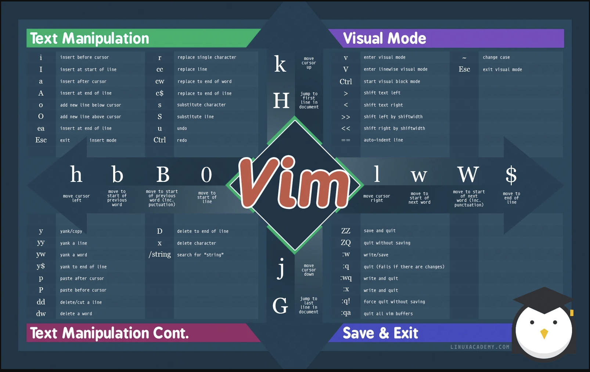

# Vim Motions - Keystrokes Cheat Sheet

Vim "motions" (plus the operators and commands that go with them) are the
keystrokes for moving and editing text in Vim / Neovim. The same keystrokes
work in most editors through a Vim mode or plugin:

- VS Code - `vscodevim` extension
- JetBrains IDEs (IntelliJ, PyCharm, GoLand, ...) - `IdeaVim` plugin
- Zed, Sublime Text (Vintage mode), Obsidian, Jupyter, shells (`set -o vi`)

Source image (LinuxAcademy cheat sheet):



## ASCII version

Items marked `*` are wrong in the original image - see [Corrections](#corrections-to-the-original-image).

```text
+===============================================================+         ^         +===============================================================+
| TEXT MANIPULATION                                             |         |         | VISUAL MODE                                                   |
+===============================================================+         |         +===============================================================+
| i    insert before cursor       r    replace single character |         k         | v    enter visual mode             ~    change case           |
| I    insert at start of line    cc   replace line             |   move cursor up  | V    enter linewise visual mode    Esc  exit visual mode      |
| a    insert after cursor        cw   replace to end of word   |                   | Ctrl start visual block mode *                                |
| A    insert at end of line      c$   replace to end of line   |         H         | >    shift text left *                                        |
| o    add new line below cursor  s    substitute character     |   jump to first   | <    shift text right *                                       |
| O    add new line above cursor  S    substitute line          |  line in document | >>   shift left by shiftwidth *                               |
| ea   insert at end of line *    u    undo                     |                   | <<   shift right by shiftwidth *                              |
| Esc  exit insert mode           Ctrl redo *                   |         ^         | ==   auto-indent line                                         |
+---------------------------------------------------------------+         |         +---------------------------------------------------------------+
                                                                          |
                                                                         / \
   <===========================================================         /   \       ===========================================================>
                                                                       /     \
                                                                      /       \
   h               b               B               0                 /         \       l               w               W               $
   move cursor     move to start   move to start   move to start    <    VIM    >      move cursor     move to start   move to start   move to end
   left            of previous     of previous     of line           \         /       right           of next word    of next WORD    of line
                   word            WORD (incl.                        \       /                                        (incl.
                                   punctuation)                        \     /                                         punctuation)
                                                                        \   /
                                                                         \ /
                                                                          |
+---------------------------------------------------------------+         |         +---------------------------------------------------------------+
| y    yank/copy                  D    delete to end of line    |         v         | ZZ    save and quit                                           |
| yy   yank a line                x    delete character         |                   | ZQ    quit without saving                                     |
| yw   yank a word                /string  search for "string"  |         j         | :w    write/save                                              |
| y$   yank to end of line                                      |  move cursor down | :q    quit (fails if there are changes)                       |
| p    paste after cursor                                       |                   | :wq   write and quit                                          |
| P    paste before cursor                                      |         G         | :x    write and quit *                                        |
| dd   delete/cut a line                                        |    jump to last   | :q!   force quit without saving                               |
| dw   delete a word                                            |  line in document | :qa   quit all vim buffers                                    |
+===============================================================+         |         +===============================================================+
| TEXT MANIPULATION CONT.                                       |         |         | SAVE & EXIT                                                   |
+===============================================================+         v         +===============================================================+
```

## Directional motions at a glance

```text
                 k  (up)            H  (first line of document)
                 ^
    h (left) <       > l (right)
                 v
                 j  (down)          G  (last line of document)

   0 <-- B <-- b <--  [cursor]  --> w --> W --> $
 line   WORD  word               word   WORD   line
 start                                          end
```

- `w` / `b` move by *word* (stops at punctuation).
- `W` / `B` move by *WORD* (whitespace separated, punctuation included).

## Corrections to the original image

The image has a few mistakes (marked `*` above). The correct behavior is:

| Key        | Image says                  | Actually                                             |
|------------|-----------------------------|------------------------------------------------------|
| `ea`       | insert at end of line       | append at end of *word* (`e` then `a`)               |
| `>` / `<`  | shift text left / right     | `>` shifts right, `<` shifts left (visual mode)      |
| `>>`/`<<`  | shift left / right by sw    | `>>` shifts right, `<<` shifts left by `shiftwidth`  |
| `Ctrl`     | redo                        | `Ctrl-r` is redo                                     |
| `Ctrl`     | start visual block mode     | `Ctrl-v` starts visual block mode                    |
| `:x`       | write and quit              | write *only if changed*, then quit (same as `ZZ`)    |
